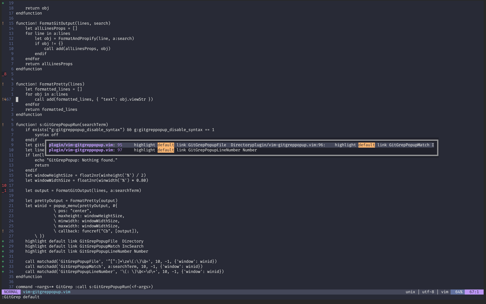

# vim-gitgreppopup

Let's you see git grep in a popup window and navigate to that file with that line number. Currently only works with vanilla vim >= 8.2 and not neovim. [Issue](https://github.com/Lilja/vim-gitgreppopup/issues/3).


## Install
with vim-plug:
```vim
Plug 'Lilja/vim-gitgreppopup'
```

Init the function:

```vim
let g:gitgreppopup_disable_syntax = 1
```

## Usage
`:GitGrep <term>`

where `<term>` is send directly to `git grep <term>`.


## Performance

It would appear that syntax highlighting makes this popup a bit sluggish. There is a param called `g:gitgreppopup_disable_syntax` that will temporarily disable syntax and will reenable it after the popup is closed. For me it has decreased the amount of slowness.

[An issue has been created for this in the vim repo](https://github.com/vim/vim/issues/6171)

## Options & Customization


The syntax `Directory` is used for showing folder paths, `Number` to show the line number, `IncSearch` for the actual match. If you'd like to see these customizable, please consider sending a PR.

`let g:gitgreppopup_disable_syntax = 1` to let this plugin disable the syntax highlighting temporarily for the other windows. This will improve performance.
